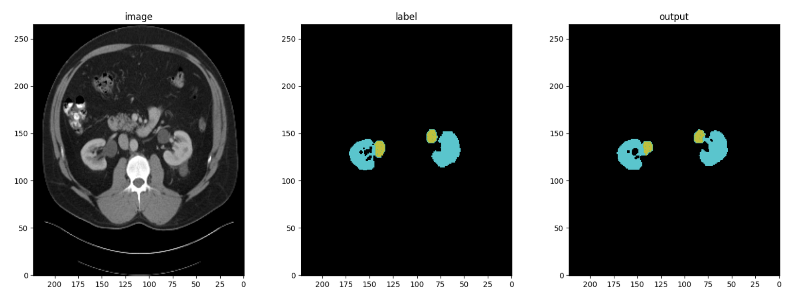

# Kidney Segmentation

3D kidney segmentation project using PyTorch and MONAI, implementing a UNet architecture for training on the KiTS (Kidney Tumor Segmentation) dataset. The model performs volumetric segmentation of kidneys from CT scans using sliding window inference.



## Setup
```bash
# Clone repository
git clone [repository-url]
cd kidney-segmentation

# Create and activate virtual environment
python -m venv venv
source venv/bin/activate  # Windows: venv\Scripts\activate

# Install dependencies
pip install -r requirements.txt
```

## Dataset
The project uses the KiTS (Kidney Tumor Segmentation) dataset. The preprocessing pipeline handles:
- 3D volume loading and normalization
- Label processing for kidney segmentation
- Train/validation splitting
- Optional dataset caching for faster training

## Usage

### Training
```bash
python main.py train --config configs/kits_train.json
```

Example training config:
```json
{
    "task": "segmentation",
    "model": "unet",
    "dataset": "kits",
    "model_params": {
        "dimensions": 3,
        "in_channels": 1,
        "channels": [16, 32, 64, 128, 256],
        "strides": [2, 2, 2, 2],
        "num_res_units": 2
    },
    "training_params": {
        "loss_fn": "dice",
        "max_epochs": 2,
        "val_interval": 2
    },
    "data_params": {
        "label_subset": {
            "kidney": 1
        },
        "val_size": 0.1,
        "cache_dataset": true
    }
}
```

Key training configuration parameters:
- `channels`: Feature channels at each UNet level
- `strides`: Downsampling factors between levels
- `num_res_units`: Residual units per UNet block
- `val_interval`: Epochs between validation runs
- `label_subset`: Target structures for segmentation
- `cache_dataset`: Enable dataset caching in memory

The training process includes:
- Real-time loss tracking
- Validation dice coefficient monitoring
- Model checkpointing based on best validation score
- Automatic learning rate adjustment
- Multi-GPU support through DataParallel

### Inference
```bash
python main.py infer --config configs/kits_infer.json
```

Example inference config:
```json
{
    "task": "segmentation",
    "dataset": "kits",
    "visualize_training_output": false,
    "evaluate_val_predictions": true,
    "data_params": {
        "label_subset": {
            "kidney": 1
        },
        "val_size": 0.1,
        "cache_dataset": false
    }
}
```

Inference features:
- Sliding window inference for handling large volumes
- Optional visualization of segmentation results
- Validation set evaluation
- Dice coefficient calculation for quality assessment

## Implementation Details

### Model Architecture
- 3D UNet with configurable depth and feature channels
- Batch normalization for training stability
- Residual connections in encoder/decoder blocks
- Sliding window inference for memory-efficient processing

### Training Process
- Dice loss optimization for segmentation quality
- ReduceLROnPlateau scheduler for learning rate adjustment
- Validation-based early stopping and model checkpointing
- Progress tracking with loss and dice coefficient metrics

### Data Processing
- On-the-fly data augmentation
- Configurable preprocessing pipeline
- Optional dataset caching for performance
- Automated train/validation splitting

## Project Structure
```
├── configs/          # JSON configuration files
│   ├── kits_train.json
│   └── kits_infer.json
├── src/
│   ├── inference/   # Inference implementation
│   │   ├── infer_seg.py
│   │   └── infer.py
│   ├── train/       # Training implementation
│   │   ├── train_seg.py
│   │   └── train.py
│   ├── preprocessing.py  # Dataset preparation
│   └── visualization.py  # Result visualization
└── main.py          # CLI entrypoint
```